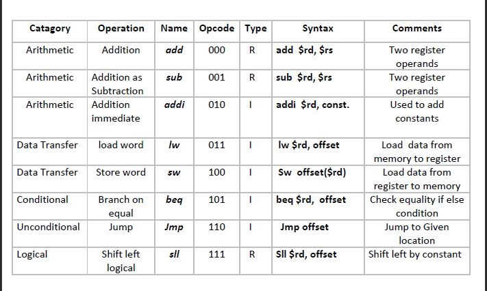

# 8-bit-RISC-Processor Computer Architecture-Project. 
This a project designed by a group of undergraduate students for the Computer Architecture Course Project. 
### Build using Logisim and C++ 

The task was to design an 8 bit single-cycle CPU that has separate Data Memory and Instruction Memory. 
There is a total of three parts to this Project.

## 1. ISA (Instruction Set Architecture) 
## 2. Assembler 
## 3. Single Cycle Processor

The Processor can run these types of programs. 

a) Simple arithmetic & logic operations
b) Programs that require checking conditions
c) Loop type of programs

# ISA
ISA Instruction Set Architecture. The First part of the project was to build our own ISA based on MIPS 32 bit ISA. Since we had only 8 bits, we had to allocate out bits very carefully, and we had to select the number of instructions as well. We have designed the ISA format as follows.  

## (R-Type) ISA Format
                          opcode	rd      rs	    Shift Amount
                          3 bits	2 bits	2 bits	1 bit

## (I-Type) ISA Format
                          opcode    rd	      Immediate
                          3 bits	2 bits	  3 bits
## (J-Type) ISA Format
                          opcode    Target
                          3 bits	5 bits

# List of Instructions 
<p align="center">
  
</p>

## Examples 
* ### ADD instruction 
```
• Operation: d = d + s
• Syntax: add $rd, $rs ($rd = $rd +$rs )
```
* ### Addi Instruction 
 * It adds a value from register with an integer value and stores the result in destination register.
```
• Operation: d = s + constant
• Syntax: addi $rd, Constant ($rd = $rd +const.)
```
* ### Load Instruction 
```
lw: It loads required value from the memory to the register for calculation .
• Operation: d = M[s + offset]
• Syntax: lw $rd, offset ( $rd =Mem[$rd+offset] )

```
* ### Store Instruction 
```
sw: It stores specific value from register to memory.
• Operation: M[d + offset] = s
• Syntax: sw $rs, offset ( Mem[$rd+offset] =$rd )
```
* ### Branch Instruction(Branch if Equal) 
* beq : It checks whether the values of two register s are same or not. If it is same it
```
 performs the following operation
• Operation: if (d == s) jump to offset
else goto next line
• Syntax: beq $rd, offset (if $rd == $AC, goto offset location )
```


# Assembler:
Assemblers can automatically generate a machine code from an assembly file written code in C++. In this project, According to the ISA, The assembler reads a program written using assembly language in a text file, then translates it into binary code and generates an output file(.txt) containing machine code. The generated output files will later be useful to run a program in the actual 8-bit Processor.

# ISA(Assembler):

The input codes are written in a text file in assembly format following the ISA. There will be one instruction per line. The output will be generated in Hexadecimal format instead of binary. This will help us later transfer this code into the Instruction Memory block of the logisim circuit.


# Single Cycle Processor: Datapath (Logisim)                                                
In this part of the project, we have designed the complete Single Cycle processor on Logisim. Based on our ISA (can be found on .doc folder), we have designed the Arithmetic Logic Unit, The Register file, and finally, connected them all in the Datapath. Circ file and completed the Project. 

# Datapath 
<p align="center">
  
</p>


# Processor Testing                                                 
In this section, we have tested our CPU with multiple numbers of Instructions as suggested. We have given input to all the instructions to solve a problem—for instance, a loop. 
All the instructions are then converted into a Hexadecimal format. Then we saved the text file and loaded it on our processor's Instruction memory to run the instructions one after another. 

## A demo instruction file can be found on the Assembler folder named demo_I.txt. 
In logisim datapath. Circ file just loads the file as an image in ROM/Instruction memory and then gives the clock to execute the instructions.
There is a input.txt file which takes the input and the output.txt file outputs the intructions as Hexadecimal numbers. Ready to run the intructions on the 8 bit CPU. 

## Example Assembly Codes: 

* ## For Loop in C++ Code
```
for (int i = 0, i < a ; i++){       Example:  [ i = $s1, a = $s2 x = $s3 ]
    x=x*8;
}

```
* ## For Loop using 8 Bit Assembly :
```
sub $s1,$s1
sub $ac,$ac ac = 0
add $ac,$s2 ac gets $s2
Loop: beq $s1,Exit
sll $s3,2 $s2*4
sll $s3,1 $s2*8
addi $s1,1
jmp Loop
Exit:
```

